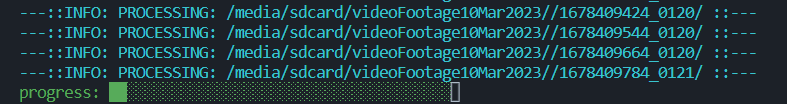

# camToMP4 

*logo by chatGPT*



`camToMP4` processes a folder with `.media` or similar files and converts them to mp4 and optionally a single merged `.mkv` file.

## Before you start

You probably have an microsdcard inside the cam, so take it out and bring it to a machine running linux/mac/wsl, capable of executing a `bash` script and first mount the sdcard:

Run `lsblk` or `blkid -o list`
```shell
blkid -o list
...
/dev/mmcblk0                           (not mounted)               
/dev/mmcblk0p1                         (not mounted)
```

Then do something like:
```shell
sudo mount /dev/mmcblk0p1 /media/sdcard
```

Now you can browse your sdcard under /media/sdcard. To unmount, do `sudo umount /media/sdcard`

You will probably have something like so under `/media/sdcard`:
```shell
DCIM
├── 2023
    ├── 03
        ├── 05
        |   ├── 1678051436_0120
        |   ├── 1678051556_0120
        |   ├── ...
        ├── 06
        ├── 07
```
Now you can do:

```shell
camToMP4.sh /media/sdcard/DCIM/2023/03/05/ -m allmp4s -c merged --prog -q
```

Above will create folder called `allmp4s` inside `05`, place the `.mp4` files along with a single `merged.mkv` file

## Usage

```bash
/bin/bash /path/to/camToMP4.sh /path/to/parentFolder/ -m allmp4s -c merged --prog -q
```

- Make `camToMP4.sh` executable and add it to `$PATH` if you want to omit the `/bin/bash`:
    ```
    cd camToMp4
    chmod +x camToMP4.sh
    export PATH=$PATH:$(pwd)
    ```
- `camToMP4` will recursively look for directories inside `parentFolder` and process `.media` files inside these directories by default.
- For every sub directory under `parentFolder`, files will be sorted and then concatenated into `.mp4` file **per sub directory**
- After all `.mp4` files are generated, they will be moved (`-m`) to a folder called `allmp4s` under `parentFolder`
- Finally, all the moved `.mp4` files will be sorted and concatenated (`-c`) into a single `.mkv` file called `merged.mkv`
- During the entire process, `mkvutils` and `ffmpeg` warnings and messages will be suppressed (`-q`) and a progress bar will be shown (`--prog`)

## Options

```
camToMP4.sh --help
```
```txt
> ˅˅˅˅˅˅˅˅˅˅˅˅˅˅˅˅˅˅˅˅˅˅˅˅˅˅˅˅˅˅˅˅˅˅˅˅˅˅˅˅˅˅˅˅˅˅˅˅˅˅˅˅˅˅˅˅˅˅˅˅˅˅˅˅˅˅˅˅˅˅˅˅˅˅˅˅˅˅˅˅
> 03-2023 - Ibrahim Tanyalcin - MIT LICENSE
> version 0.0.1
> -m --mv --move      : Move the generated .mp4 files to specified folder. If merge
>                       option is given, also move the generated .mkv file to there
> -c --merge --combine: Concat the resulting .mp4 files to a single .mkv file
> -n --num --number   : Max amount of directories to be processed
> -e --ext --extension: Extension of input files. Defaults to "media"
> --hex               : If input files names are not unix epoch, append a random
>                       hex string to differentiate
> --dryRun            : Do not do anything, just preview
> -p --pat --pattern  : A pattern to filter folder basename. Only folders with
>                       basename matching the pattern are processed.
> --progress --prog   : Show progress bar
> --noinfo            : Do not show info on what is being done
> -q --quiet          : Suppress "ffmpeg" and "mkvmerge" messages/warnings
> ^^^^^^^^^^^^^^^^^^^^^^^^^^^^^^^^^^^^^^^^^^^^^^^^^^^^^^^^^^^^^^^^^^^^^^^^^^^^^^^^
```

## Example Directory Structure of a `parentFolder`
```shell
cd parentFolder
tree -d
.
├── 1678402800_0120
├── 1678402920_0120
├── 1678403040_0121
├── 1678403161_0120
├── 1678403281_0120
├── 1678403401_0120
├── 1678403521_0121
├── 1678403642_0120
├── 1678403762_0120
```

- If the folder names have `_*`, that part is removed.
- If the remaning part matches the regex `[1-9]+([0-9])`, then it is assumed to be time since Unix Epoch and converted to `YYYYMMDD-HHMMSS`.
- If the above is not the case with the folder names, then the names are left as is. If `--hex` option is specified, the folder names are appended with an underscore, followed by a hexadecimal string. This is useful with the `-m` option, as all the resulting `.mp4`s are moved to a folder, it prevents name collusions.

## Example Structure of a sub directory

```shell
tree 1678488437_0120
1678488437_0120
├── 0000.media
├── 0011.media
├── 0021.media
├── 0032.media
├── 0042.media
├── 0053.media
├── 0063.media
├── 0074.media
├── 0084.media
├── 0095.media
├── 0105.media
└── 0116.media
```

- By default, `.media` files are **sorted** and then processed. The `-e` option can be specified to another string to process instead of `media`.

## PRs and Issues

There is a shortened, commented version of the script inside `chatGPTcomments` folder. If you have any suggestions/features etc., send a PR. 
